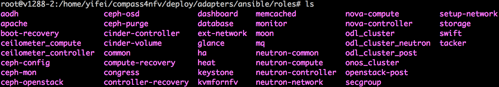
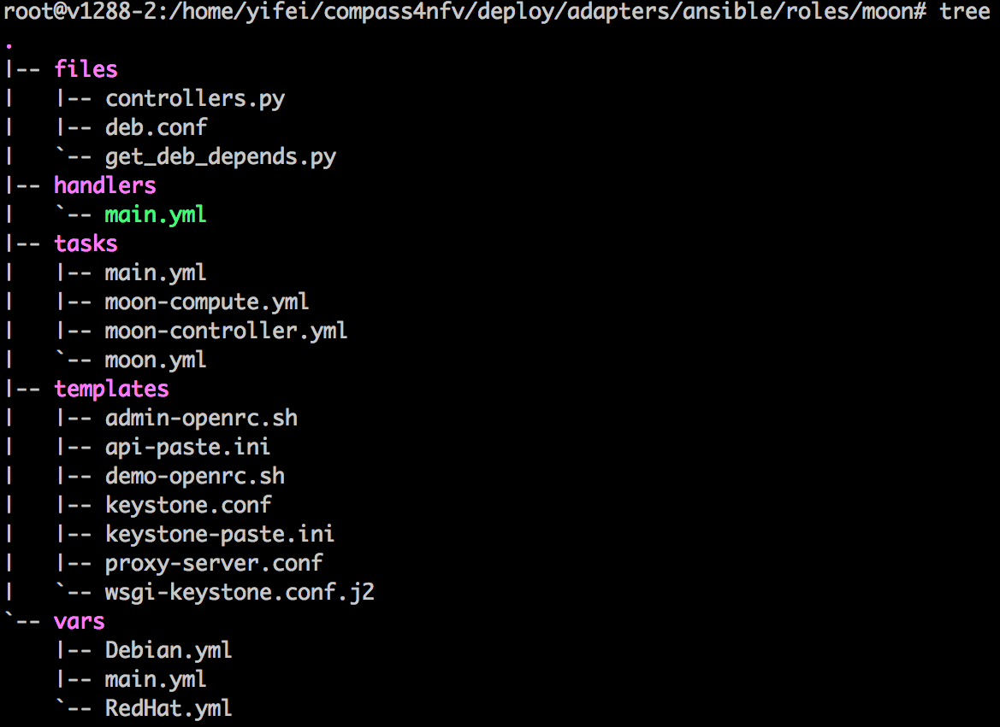
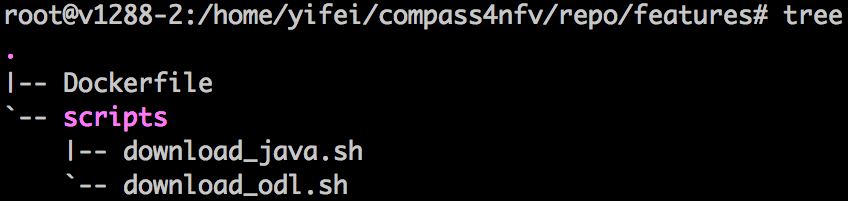

.. This work is licensed under a Creative Commons Attribution 4.0 International License.
.. http://creativecommons.org/licenses/by/4.0
.. (c) by Weidong Shao (HUAWEI) and Justin Chi (HUAWEI)

How to integrate a feature into compass4nfv
===========================================

This document describes how to integrate a feature (e.g. sdn, moon, kvm, sfc)
into compass installer. Follow the steps below, you can achieve the goal.

Create a role for the feature
-----------------------------

Currently Ansible is the main adpter of compass installer, which is used to deploy
all the roles listed in the playbooks. ( More details about ansible and playbook can be
achieved according to the Reference. ) The mostly used playbook in compass4nfv is named
"HA-ansible-multinodes.yml" located in "*your_path_to_compass4nfv*/compass4nfv/deploy/
adapters/ansible/openstack/".

Before you add your role into the playbook, create your role under the directory of
"*your_path_to_compass4nfv*/compass4nfv/deploy/adapters/ansible/roles/". For example
Fig 1 shows some roles currently existed in compass4nfv.

    Fig 1. Existed roles in compass4nfv

Let's take a look at "moon" and understand the construction of a role. Fig 2
below presents the tree of "moon".

    Fig 2. Tree of moon role

There are five directories in moon, which are files, handlers, tasks, templates and vars.
Almost every role has such five directories.

For "files", it is used to store the files you want to copy to the hosts without any
modification. These files can be configuration files, code files and etc. Here in moon's
files directory, there are two python files and one configuration file. All of the three
files will be copied to controller nodes for some purposes.

For "handlers", it is used to store some operations frequently used in your tasks. For
example, restart the service deamon.

For "tasks", it is used to store the task yaml files. You need to add the yaml files including
the tasks you write to deploy your role on the hosts. Please attention that a *main.yml*
should be existed as the entrance of running tasks. In Fig 2, you can find that there are four
yaml files in the tasks directory of moon. The *main.yml* is the entrance which will call the
other three yaml files.

For "templates", it is used to store the files that you want to replace some variables in them
before copying to hosts. These variables are usually defined in "vars" directory. This can
avoid hard coding.

For "vars", it is used to store the yaml files in which the packages and variables are defined.
The packages defined here are some generic debian or rpm packages. The script of making repo
will scan the packages names here and download them into related PPA. For some special
packages, section "Build packages for the feature" will introduce how to handle with special
packages. The variables defined here are used in the files in "templates" and "tasks".

Note: you can get the special packages in the tasks like this:

.. code-block:: bash

    - name: get the special packages' http server
      shell: awk -F'=' '/compass_server/ {print $2}' /etc/compass.conf
      register: http_server

    - name: download odl package
      get_url:
        url: "http://{{ http_server.stdout_lines[0] }}/packages/odl/{{ odl_pkg_url }}"
        dest: /opt/

Build packages for the feature
------------------------------

In the previous section, we have explained how to build the generic packages for your feature.
In this section, we will talk about how to build the special packages used by your feature.

    Fig 3. Features building directory in compass4nfv

Fig 3 shows the tree of "*your_path_to_compass4nfv*/compass4nfv/repo/features/". Dockerfile
is used to start a docker container to run the scripts in scripts directory. These scripts
will download the special feature related packages into the container. What you need to do is
to write a shell script to download or build the package you want. And then put the script
into "*your_path_to_compass4nfv*/compass4nfv/repo/features/scripts/". Attention that, you need
to make a directory under */pkg*. Take opendaylight as an example:

.. code-block:: bash

    mkdir -p /pkg/odl

After downloading or building your feature packges, please copy all of your packages into the
directory you made, e.g. */pkg/odl*.

Note: If you have specail requirements for the container OS or kernel vesion, etc. Please
contact us.

After all of these, come back to *your_path_to_compass4nfv*/compass4nfv/ directory, and run
the command below:

.. code-block:: bash

    ./repo/make_repo.sh feature # To get special packages

    ./repo/make_repo.sh openstack # To get generic packages

When excution finished, you will get a tar package named *packages.tar.gz* under
"*your_path_to_compass4nfv*/compass4nfv/work/repo/". Your feature related packges have been
archived in this tar package. And you will also get the PPA packages which includes the generic
packages you defined in the role directory. The PPA packages are *xenial-newton-ppa.tar.gz*
and *centos7-newton-ppa.tar.gz*, also in "*your_path_to_compass4nfv*/compass4nfv/work/repo/".

Build compass ISO including the feature
---------------------------------------

Before you deploy a cluster with your feature installed, you need an ISO with feature packages,
generic packages and role included. This section introduces how to build the ISO you want.
What you need to do are two simple things:

**Configure the build configuration file**

The build configuration file is located in "*your_path_to_compass4nfv*/compass4nfv/build/".
There are lines in the file like this:

.. code-block:: bash

    export APP_PACKAGE=${APP_PACKAGE:-$FEATURE_URL/packages.tar.gz}

    export XENIAL_NEWTON_PPA=${XENIAL_NEWTON_PPA:-$PPA_URL/xenial-newton-ppa.tar.gz}

    export CENTOS7_NEWTON_PPA=${CENTOS7_NEWTON_PPA:-$PPA_URL/centos7-newton-ppa.tar.gz}

Just replace the $FEATURE_URL and $PPA_URL to the directory where your *packages.tar.gz*
located in. For example:

.. code-block:: bash

    export APP_PACKAGE=${APP_PACKAGE:-file:///home/opnfv/compass4nfv/work/repo/packages.tar.gz}

    export XENIAL_NEWTON_PPA=${XENIAL_NEWTON_PPA:-file:///home/opnfv/compass4nfv/work/repo/xenial-newton-ppa.tar.gz}

    export CENTOS7_NEWTON_PPA=${CENTOS7_NEWTON_PPA:-file:///home/opnfv/compass4nfv/work/repo/centos7-newton-ppa.tar.gz}

**Build the ISO**

After the configuration, just run the command below to build the ISO you want for deployment.

.. code-block:: bash

    build.sh

