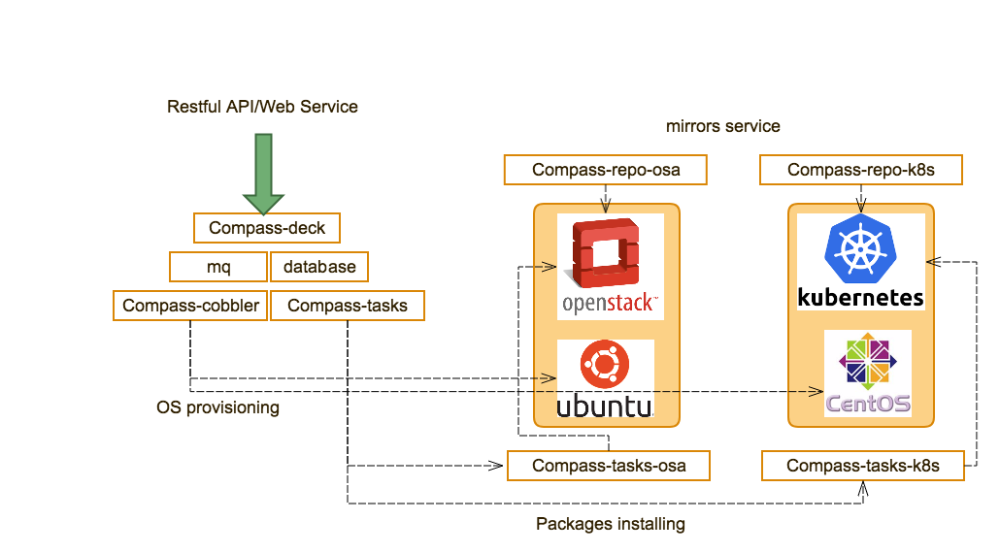

.. This work is licensed under a Creative Commons Attribution 4.0 International License.
.. http://creativecommons.org/licenses/by/4.0
.. (c) by Justin Chi (HUAWEI) and Yifei Xue (HUAWEI)

Introduction of Containerized Compass
=====================================

Containerized Compass uses five compass containers instead of a single VM.

Each container stands for a micro service and compass-core function separates into these five micro services:

        - Compass-deck : RESTful API and DB Handlers for Compass
        - Compass-tasks : Registered tasks and MQ modules for Compass
        - Compass-cobbler : Cobbler container for Compass
        - Compass-db : Database for Compass
        - Compass-mq : Message Queue for Compass

Compass4nfv has several containers to satisfy OPNFV requirements:

        - Compass-tasks-osa : compass-task's adapter for deployment OpenStack via OpenStack-ansible
        - Compass-tasks-k8s : compass-task's adapter for deployment Kubernetes
        - Compass-repo-osa-ubuntu : optional container to support OPNFV offfline installation via OpenStack-ansible
        - Compass-repo-osa-centos : optional container to support OPNFV offfline installation via OpenStack-ansible

Picture below shows the new architecture of compass4nfv:

    Fig 1. New Archietecture of Compass4nfv
