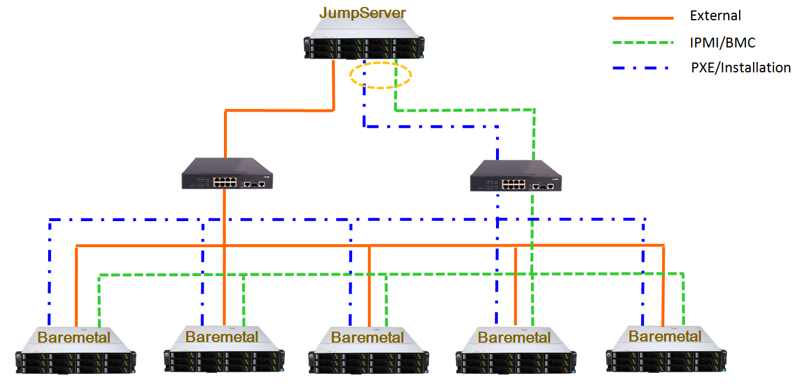
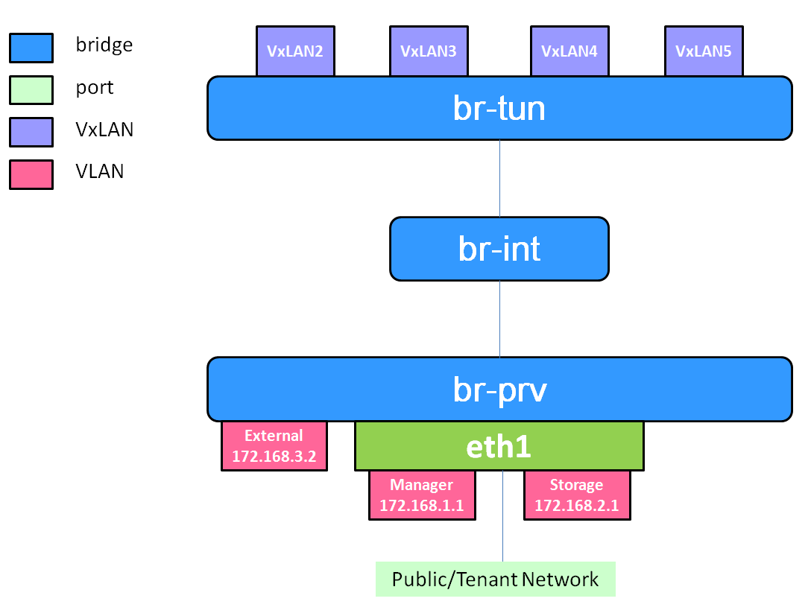

.. two dots create a comment. please leave this logo at the top of each of your rst files.

Prerequisite
============

1. One jumpserver installed with Ubuntu14.04.

2. If baremetal is targeted deployment environment, we suggest the environment as the following topology picture,
jumpserver and baremetal need 3 ethernet ports, one ports(External/Tenant) connects to one switch,
and two ports (IPMI/BMC, PXE/Installation) connects to another switch.

If jumpserver doesn't have enough ethernet ports, two ports is
also acceptable(IPMI/BMC and PXE/Installation run through one ethernet port).

If switches are not enough, one switch with 2 VLANs is also acceptable.

3. Pre-allocate BMC IP addresses for baremetals, and get accounts and passwords of BMC on baremetals.

4. If virtual machines is targeted deployment environment, the jumpserver also needs 100G storage and 16G RAM.

5. Gerrit: git clone https://gerrit.opnfv.org/gerrit/compass4nfv to the jumpserver.

6. Please don't git clone compass4nfv in the root directory.

Attention: Compass4nfv does stick on the OPNFV communities' Operating System version requirement.
For Brahmaputra, Ubuntu14.04 or newer and Centos7.0 or newer are requested,
so the targeted deployment environment will be installed on Ubuntu14.04 or Centos7.1.

How to build a customized ISO
=============================

If you want to use Compass4nfv official ISO to deploy the environment, you can jump over this section.

This section indicates how to add additional packages and how to build a new compass4nfv ISO file
so that Compass4nfv would install the additional packages automatically during the deployment.

* Approach 1 ----- apt/yum installation:

1. Confirm the targeted packages could be installed via apt-get(Ubuntu) and yum(Centos),
you can verify on your own environment first by commands
"apt-get install {targeted packages}" on Ubuntu and "yum install {targeted packages}" on Centos.

2. Create a new role folder ({newrole}) in the compass4nfv/deploy/adapters/ansible/roles/,
create a new folder named "vars" in the new role folder({newrole}),
and create a file named "main.yml" and add "---" at the head of this file.

3. If the targeted packages names are same in both Ubuntu and Centos, you just need edit main.yml.

Add the packages' names as following:

.. code-block:: bash

    packages_noarch:
       - {targeted packages1}
       - {targeted packages2}
       - {targeted packages3}
       ...

4. If the targeted packages' names are different in Ubuntu and Centos,
you need create "Debian.yml" and/or "RedHat.yml" in the same folder as "main.yml" and add "---" at the head of the files.

Add the packages' names as following in the "Debian.yml" and/or "RedHat.yml" :

.. code-block:: bash

     ---
     packages:
        - {targeted Ubuntu/RedHat packages1}
        - {targeted Ubuntu/RedHat packages2}
        - {targeted Ubuntu/RedHat packages3}
        ...

Also you can refer "compass4nfv/deploy/adapters/ansible/roles/glance/vars" as example.

5.1 Add the new role to ansible so that Compass4nfv will install the packages during the deployment :
"enter compass4nfv/deploy/adapters/ansible/openstack_juno/" and edit HA-ansible-multinodes.yml and/or single-controller.yml,
add {newrole} at an appropriate position, please be aware of that compass4nfv deploys the roles
in the order as list in HA-ansible-multinodes.yml/single-controller.yml, you can add a new section as the following::

     - hosts: all/controller/compute/ha
       remote_user: root
       sudo: True
       roles:
           - {newrole}

The first line "hosts" of the section means compass4nfv will deploy {newrole} on which baremetals/VMs,
"all" means it deploys on all baremetals/VMs, "controller" means it deploys on all controller and so on.

Also you can refer "glance" position in HA-ansible-multinodes.yml and single-controller.yml.

Attention
    "HA-ansible-multinodes.yml" deploys controllers backup targeted environment
and 3 controllers in backup mode + 2 compute by default;.
    "single-controller.yml" deploys 1 controller + 4 compute.

5.2 Or insert the new role into the existing section at an appropriate position in
HA-ansible-multinodes.yml and single-controller.yml.

    Example:

.. code-block:: bash

    - hosts: controller/all/compute/ha
      remote_user: root
      sudo: True
      roles:
        - database
        - mq
        - keystone
        - nova-controller
        - neutron-controller
        - {newrole}

Please pay attention to the first line "hosts" by which Compass4nfv deploys {newrole} on which baremetals/VMs.

Also please pay attention to the position inserted as Compass4nfv deploys the packages in the order as list.

Also you can refer "glance" position as example in HA-ansible-multinodes.yml and single-controller.yml.

6. Run compass4nfv/build/make_repo.sh.

7. After 6 finishs, please check "compass4nfv/work/repo/" folder,
if files as following exist in the folder, that means building packages successfully.

centos7-juno-ppa.tar.gz is OpenStack Juno version for Centos7.

trusty-juno-ppa.tar.gz is OpenStack Juno version for Ubuntu14.04.

trusty-kilo-ppa.tar.gz is OpenStack Kilo version for Ubuntu14.04.

8. Edit compass4nfv/build/build.conf, find CENTOS7_JUNO_PPA and TRUSTY_JUNO_PPA items,
modify these 2 items as local paths(if you just want deploy with one operating system, you just modify one item).

CENTOS7_JUNO_PPA is packages path for Centos, TRUSTY_JUNO_PPA is packages path for Ubuntu

.. code-block:: bash

    CENTOS7_JUNO_PPA=/compass4nfv/work/repo/centos7-juno-ppa.tar.gz

    TRUSTY_JUNO_PPA=/compass4nfv/work/repo/trusty-juno-ppa.tar.gz

9. Run compass4nfv/build.sh to build a new ISO, after finished, if there is a new ISO file compass.iso
in the "compass4nfv/work/building" folder, that means building iso successfully.

* Approach 2 ---- source installation

This section indicates to install packages from source codes. If the targeted packages could not be
installed from apt-get and yum but from source codes, please refer this section.

1. Enter folder "compass4nfv/build/arch/Debian" or "compass4nfv/build/arch/RedHat" that depend on
operating system you want to install package, create a bash(.sh) file
which includes all the commands which install the packages from source codes.

   Example:

.. code-block:: bash

    #!/bin/bash
    apt-get update
    apt-get install -y build-essential fakeroot debhelper \
             autoconf automake bzip2 libssl-dev \
             openssl graphviz python-all procps \
             python-qt4 python-zopeinterface \
             python-twisted-conch libtool wget

    pushd .
    cd /tmp
    wget http://openvswitch.org/releases/openvswitch-2.3.1.tar.gz
    tar -zxvf openvswitch-2.3.1.tar.gz
    cd openvswitch-2.3.1
    DEB_BUILD_OPTIONS='parallel=8 nocheck' fakeroot debian/rules binary
    cd -
    cp -f *.deb /var/cache/apt/archives/
    popd

Please pay attention to the last second sentence, all the compiled packages need to be
copied to the "/var/cache/apt/archives/"(Ubuntu) folder, and for Centos, the folder is ... to be continued .

2. Add a new role so that Compass4nfv will install the packages during the deployment,
create a new role folder ({newrole}) in the "compass4nfv/deploy/adapters/ansible/roles/",
create a new folder named "vars" in the new role folder({newrole}),
and create a file named "main.yml" and add "---" at the head of this file.

3. If the packages' names are same in both Ubuntu and Centos, you just need edit main.yml.

Add the packages' names as following:

.. code-block:: bash

    packages_noarch:
       - {targeted packages1}
       - {targeted packages2}
       - {targeted packages3}
       ...

4. If the targeted packages' names are different in Ubuntu and Centos,
you need create "Debian.yml" and/or "RedHat.yml" in the same folder as "main.yml"
and add "---" at the head of the files.

Add the packages' names as following in the "Debian.yml" and/or "RedHat.yml" :

.. code-block:: bash

     packages:
        - {targeted Ubuntu/RedHat packages1}
        - {targeted Ubuntu/RedHat packages2}
        - {targeted Ubuntu/RedHat packages3}
        ...

Also you can refer "compass4nfv/deploy/adapters/ansible/roles/glance/vars" as example.

5.1 Enter "compass4nfv/deploy/adapters/ansible/openstack_juno/" and edit HA-ansible-multinodes.yml
and/or single-controller.yml, add {newrole} at an appropriate position, please be aware of that compass4nfv
deploys the roles in the order as list in HA-ansible-multinodes.yml/single-controller.yml,
you can add a new section as the following::

     - hosts: all/controller/compute/ha
       remote_user: root
       sudo: True
       roles:
           - {newrole}

The first line "hosts" of the section means compass4nfv will deploy {newrole} on which baremetals/VMs,
"all" means it deploys on all baremetals/VMs, "controller" means it deploys on all controller and so on.

Also you can refer "glance" position in HA-ansible-multinodes.yml and single-controller.yml.

Attention
    "HA-ansible-multinodes.yml" deploys controllers backup targeted environment and
3 controllers in backup mode + 2 compute by default.
    "single-controller.yml" deploys 1 controller + 4 compute.

5.2 Or insert the new role into the existing section at an appropriate position
in HA-ansible-multinodes.yml and single-controller.yml.

    Example:

.. code-block:: bash

    - hosts: controller
      remote_user: root
      sudo: True
      roles:
        - database
        - mq
        - keystone
        - nova-controller
        - neutron-controller
        - {newrole}

Please pay attention to the first line "hosts" by which Compass4nfv deploys {newrole} on which baremetals/VMs.

Also please pay attention to the position inserted as Compass4nfv deploys the packages in the order as list.

Also you can refer "glance" position as example in HA-ansible-multinodes.yml and single-controller.yml.

6. Run compass4nfv/build/make_repo.sh .

7. After 6 finishs, please check "compass4nfv/work/repo/" folder,
if files as following exist in the folder, that means building packages successfully.

centos7-juno-ppa.tar.gz is OpenStack Juno version for Centos7.

trusty-juno-ppa.tar.gz is OpenStack Juno version for Ubuntu14.04.

trusty-kilo-ppa.tar.gz is OpenStack Kilo version for Ubuntu14.04.

8. Edit compass4nfv/build/build.conf, find CENTOS7_JUNO_PPA and TRUSTY_JUNO_PPA items,
modify these 2 items as local paths(if you just want deploy with one operating system, you just modify one item).

CENTOS7_JUNO_PPA is packages path for Centos, TRUSTY_JUNO_PPA is packages path for Ubuntu

.. code-block:: bash

    CENTOS7_JUNO_PPA=/compass4nfv/work/repo/centos7-juno-ppa.tar.gz

    TRUSTY_JUNO_PPA=/compass4nfv/work/repo/trusty-juno-ppa.tar.gz

9. Run compass4nfv/build.sh to build a new ISO, after finished, if there is a new ISO file compass.iso
in the "compass4nfv/work/building" folder, that means building ISO successfully.

* Approach 3 ---- autonomous packages installation

package installed, to be continued...

How to deploy baremetal and VMs
===============================

Before deployment, there are some network configuration to be checked based on your reality network topology.
Compass4nfv network configuration file is "compass4nfv/deploy/conf/network_cfg.yaml".

Based on current default network configuration, the hosts(controller,compute) network is as following picture.

network_cfg.yaml

.. code-block:: bash

    provider_net_mappings:
      - name: br-prv
        network: physnet
        interface: eth1
        type: ovs
        role:
          - controller
          - compute
    sys_intf_mappings:
      - name: mgmt
        interface: eth1
        vlan_tag: 2
        role:
          - controller
          - compute
      - name: storage
        interface: eth1
        vlan_tag: 3
        role:
          - controller
          - compute
      - name: external
        interface: br-prv
        vlan_tag: 4
        role:
          - controller
          - compute
    ip_settings:
      - name: mgmt
        ip_ranges:
        - - "172.16.1.1"
          - "172.16.1.254"
        cidr: "172.16.1.0/24"
        role:
          - controller
          - compute
      - name: storage
        ip_ranges:
        - - "172.16.2.1"
          - "172.16.2.254"
        cidr: "172.16.2.0/24"
        role:
          - controller
          - compute
      - name: external
        ip_ranges:
        - - "172.16.3.2"
          - "172.16.3.100"
        cidr: "172.16.3.0/24"
        gw: "172.16.3.1"
        role:
          - controller
          - compute

"br-prv" is a bridge created by OpenvSwitch, "mgmt" "storage" and "external" are VLAN.

"mgmt" "stoarge" and "br-prv" can locate on any ethernet port("interface")
as long as the host can communicate with other hosts via this ethernet.

"external" must locate on "br-prv".

"mgmt" "storage" and "external" could be set subnet as you like,
but must be in different subnets and "vlan_tag" also must be different.

Also check the following items in file "compass4nfv/deploy/conf/base.conf"

.. code-block:: bash

    export INSTALL_IP=${INSTALL_IP:-10.1.0.12}
    export INSTALL_MASK=${INSTALL_MASK:-255.255.255.0}
    export INSTALL_GW=${INSTALL_GW:-10.1.0.1}

Item "INSTALL_IP" is used to install baremetal/VM during deployment.
Compass4nfv on jumpserver creates a bridge with IP address "INSTALL_GW" and
all baremetal/VM deployments are via this subnet. Please don't set this item
as the same subnet as any other ip configuration in the jumpserver.

* Deploy baremetal in HA mode:

1. (optional) If you have built a new ISO before and want to use the new ISO,
please edit compass4nfv/deploy/conf/base.conf file,
modify the item "ISO_URL" as export ISO_URL=file:///compass4nfv/work/building/compass.iso

2. Edit compass4nfv/deploy/conf/baremetal_cluster_general.yml, to be continued...

3. Edit compass4nfv/deploy/conf/base.conf, modify the item "export OM_NIC=${OM_NIC:-eth3}"
as the install network ethernet port based your jumpserver.

4. Run compass4nfv/deploy.sh baremetal_cluster_general

* Deploy baremetal in Single mode:

1. (optional) If you have built a new ISO before and want to use the new ISO,
please edit compass4nfv/deploy/conf/base.conf file, modify the item "ISO_URL"
as export ISO_URL=file:///compass4nfv/work/building/compass.iso

2. Edit compass4nfv/deploy/conf/baremetal_five.yml , change items
[name, mac, ipmiUser, ipmiPass, ipmiIp, roles] based on the baremetal to be deployed.

3. Edit compass4nfv/deploy/conf/base.conf, modify the item
"export OM_NIC=${OM_NIC:-eth3}" as the install network ethernet port based your jumpserver.

4. Run compass4nfv/deploy.sh baremetal_five

* Deploy VMs in HA mode:

1. (optional) If you have built a new ISO before and want to use the new ISO,
please edit compass4nfv/deploy/conf/base.conf file, modify the item
"ISO_URL" as export ISO_URL=file:///compass4nfv/work/building/compass.iso

2. (Optional) Edit compass4nfv/deploy/conf/virtual_cluster.yml, change items [name, roles] as you want,
also you could reduce or add hosts sections as you want.
And 3 controller in HA mode and 2 compute will be deployed without changing this yml file.

3. Run compass4nfv/deploy.sh virtual_cluster  or  Run compass4nfv/deploy.sh .

* Deploy baremetal in Single mode:

1. (optional) If you have built a new ISO before and want to use the new ISO,
please edit compass4nfv/deploy/conf/base.conf file,
modify the item "ISO_URL" as export ISO_URL=file:///compass4nfv/work/building/compass.iso

2. (Optional) Edit compass4nfv/deploy/conf/virtual_five.yml, change items [name, roles] as you want,
also you could reduce or add hosts sections as you want.
And 3 controller in HA mode and 2 compute will be deployed without changing this yml file.

3. Run compass4nfv/deploy.sh virtual_five .

Attention:
Roles here includes controller compute network storage ha odl and onos.

How to deploy without internet access
=====================================

If you have created your own ISO file(compass.iso), you realy could deploy without internet access,
edit "compass4nfv/deploy/conf/base.conf" file and assign item ISO_URL as your local ISO file path
(export ISO_URL=file:///compass4nfv/work/building/compass.iso).
Then execute "compass4nfv/deploy.sh" and Compass4nfv could deploy with local compass.iso without internet access.

Also you can download compass.iso first from OPNFV artifacts repository
(http://artifacts.opnfv.org/, search compass4nfv and select an appropriate ISO file) via wget or curl.
After this, edit "compass4nfv/deploy/conf/base.conf" file and assign item ISO_URL as your local ISO file path.
Then execute "compass4nfv/deploy.sh" and Compass4nfv could deploy with local compass.iso without internet access.

How to integration plugins
==========================

