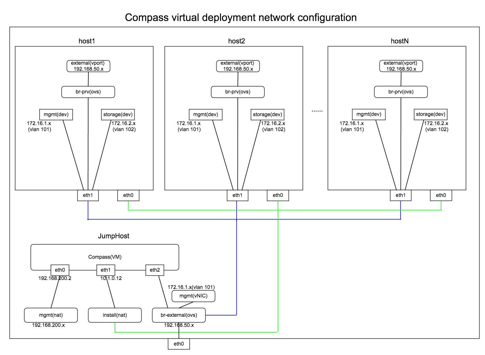

.. This work is licensed under a Creative Commons Attribution 4.0 International Licence.
.. http://creativecommons.org/licenses/by/4.0
.. (c) by Weidong Shao (HUAWEI) and Justin Chi (HUAWEI)

Installation Guide (Virtual Deployment)
=======================================

Nodes Configuration (Virtual Deployment)
----------------------------------------

The below file is the inventory template of deployment nodes:

"./deploy/conf/vm_environment/huawei-virtual1/dha.yml"

The "dha.yml" is a collectively name for "os-nosdn-nofeature-ha.yml
os-ocl-nofeature-ha.yml os-odl_l2-moon-ha.yml etc".

You can write your own address/roles reference to it.

        - name -- Host name for deployment node after installation.

        - roles -- Components deployed.

**Set TYPE and FLAVOR**

E.g.

.. code-block:: yaml

    TYPE: virtual
    FLAVOR: cluster

**Assignment of different roles to servers**

E.g. Openstack only deployment roles setting

.. code-block:: yaml

    hosts:
      - name: host1
        roles:
          - controller
          - ha

      - name: host2
        roles:
          - compute

NOTE:
IF YOU SELECT MUTIPLE NODES AS CONTROLLER, THE 'ha' role MUST BE SELECT, TOO.

E.g. Openstack and ceph deployment roles setting

.. code-block:: yaml

    hosts:
      - name: host1
        roles:
          - controller
          - ha
          - ceph-adm
          - ceph-mon

      - name: host2
        roles:
          - compute
          - ceph-osd

E.g. Openstack and ODL deployment roles setting

.. code-block:: yaml

    hosts:
      - name: host1
        roles:
          - controller
          - ha
          - odl

      - name: host2
        roles:
          - compute

E.g. Openstack and ONOS deployment roles setting

.. code-block:: yaml

    hosts:
      - name: host1
        roles:
          - controller
          - ha
          - onos

      - name: host2
        roles:
          - compute

Network Configuration (Virtual Deployment)
------------------------------------------

Before deployment, there are some network configuration to be checked based
on your network topology.Compass4nfv network default configuration file is
"compass4nfv/deploy/conf/vm_environment/huawei-virtual1/network.yml".
You can write your own reference to it.

**The following figure shows the default network configuration.**

.. code-block:: console

      +--+                          +--+
      |  |                          |  |
      |  |      +------------+      |  |
      |  +------+  Jumphost  +------+  |
      |  |      +------+-----+      |  |
      |  |             |            |  |
      |  |             +------------+  |
      |  |                          |  |
      |  |      +------------+      |  |
      |  +------+    host1   +------+  |
      |  |      +------+-----+      |  |
      |  |             |            |  |
      |  |             +------------+  |
      |  |                          |  |
      |  |      +------------+      |  |
      |  +------+    host2   +------+  |
      |  |      +------+-----+      |  |
      |  |             |            |  |
      |  |             +------------+  |
      |  |                          |  |
      |  |      +------------+      |  |
      |  +------+    host3   +------+  |
      |  |      +------+-----+      |  |
      |  |             |            |  |
      |  |             +------------+  |
      |  |                          |  |
      |  |                          |  |
      +-++                          ++-+
        ^                            ^
        |                            |
        |                            |
      +-+-------------------------+  |
      |      External Network     |  |
      +---------------------------+  |
             +-----------------------+---+
             |    Installation Network   |
             +---------------------------+

interfaces and nics (default one nic for openstack networks)

Start Deployment (Virtual Deployment)
-------------------------------------

1. Edit deploy.sh

Set OS version and OpenStack version for deployment nodes.
    Compass4nfv Colorado supports three OS version based openstack mitaka.

E.g.

.. code-block:: bash

    ######################### The environment for Openstack ######################
    # Ubuntu16.04 Newton
    #export OS_VERSION=xenial
    #export OPENSTACK_VERSION=newton_xenial

    # Ubuntu14.04 Mitaka
    #export OS_VERSION=trusty
    #export OPENSTACK_VERSION=mitaka

    # Ubuntu16.04 Mitaka
    #export OS_VERSION=xenial
    #export OPENSTACK_VERSION=mitaka_xenial

    # Centos7 Mitaka
    #export OS_VERSION=centos7
    #export OPENSTACK_VERSION=mitaka

    # Redhat7 OSP9
    #export OS_VERSION=redhat7
    #export OPENSTACK_VERSION=osp9

Set ISO image that you want to deploy

E.g.

.. code-block:: bash

    # ISO_URL is your iso's absolute path
    # export ISO_URL=file:///home/compass/compass4nfv.iso
    # or
    # export ISO_URL=http://artifacts.opnfv.org/compass4nfv/colorado/opnfv-colorado.1.0.iso

Set scenario that you want to deploy

E.g.

nosdn-nofeature scenario deploy sample

.. code-block:: bash

    # DHA is your dha.yml's path
    export DHA=./deploy/conf/vm_environment/os-nosdn-nofeature-ha.yml

    # NETWORK is your network.yml's path
    export NETWORK=./deploy/conf/vm_environment/huawei-virtual1/network.yml

ocl-nofeature scenario deploy sample

.. code-block:: bash

    # DHA is your dha.yml's path
    export DHA=./deploy/conf/vm_environment/os-ocl-nofeature-ha.yml

    # NETWORK is your network.yml's path
    export NETWORK=./deploy/conf/vm_environment/huawei-virtual1/network_ocl.yml

odl_l2-moon scenario deploy sample

.. code-block:: bash

    # DHA is your dha.yml's path
    export DHA=./deploy/conf/vm_environment/os-odl_l2-moon-ha.yml

    # NETWORK is your network.yml's path
    export NETWORK=./deploy/conf/vm_environment/huawei-virtual1/network.yml

odl_l2-nofeature scenario deploy sample

.. code-block:: bash

    # DHA is your dha.yml's path
    export DHA=./deploy/conf/vm_environment/os-odl_l2-nofeature-ha.yml

    # NETWORK is your network.yml's path
    export NETWORK=./deploy/conf/vm_environment/huawei-virtual1/network.yml

odl_l3-nofeature scenario deploy sample

.. code-block:: bash

    # DHA is your dha.yml's path
    export DHA=./deploy/conf/vm_environment/os-odl_l3-nofeature-ha.yml

    # NETWORK is your network.yml's path
    export NETWORK=./deploy/conf/vm_environment/huawei-virtual1/network.yml

onos-nofeature scenario deploy sample

.. code-block:: bash

    # DHA is your dha.yml's path
    export DHA=./deploy/conf/vm_environment/os-onos-nofeature-ha.yml

    # NETWORK is your network.yml's path
    export NETWORK=./deploy/conf/vm_environment/huawei-virtual1/network_onos.yml

onos-sfc deploy scenario sample

.. code-block:: bash

    # DHA is your dha.yml's path
    export DHA=./deploy/conf/vm_environment/os-onos-sfc-ha.yml

    # NETWORK is your network.yml's path
    export NETWORK=./deploy/conf/vm_environment/huawei-virtual1/network_onos.yml

2. Run ``deploy.sh``

.. code-block:: bash

    ./deploy.sh
