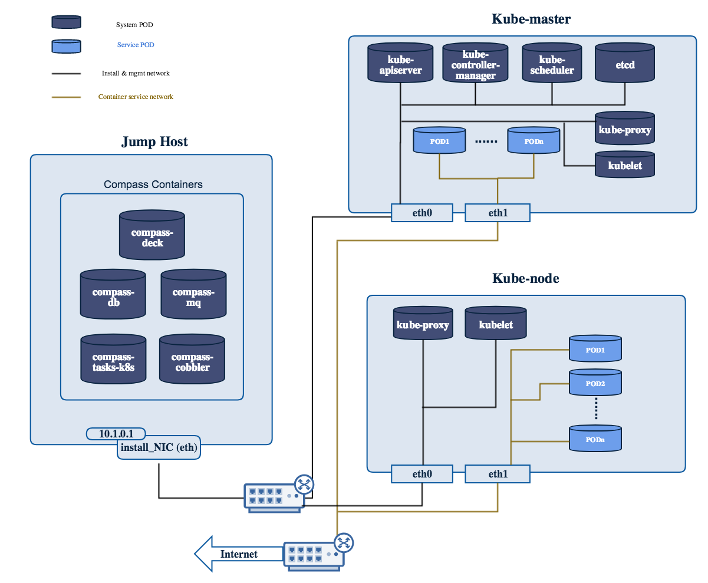

.. This work is licensed under a Creative Commons Attribution 4.0 International Licence.
.. http://creativecommons.org/licenses/by/4.0
.. (c) by Yifei Xue (HUAWEI) and Justin Chi (HUAWEI)

Installation of K8s on virtual machines
=======================================

Quick Start
-----------

Only 1 command to try virtual deployment, if you have Internet access. Just Paste it and Run.

.. code-block:: bash

    curl https://raw.githubusercontent.com/opnfv/compass4nfv/master/quickstart_k8s.sh | bash

If you want to deploy noha with1 controller and 1 compute, run the following command

.. code-block:: bash

    export SCENARIO=k8-nosdn-nofeature-noha.yml
    export VIRT_NUMBER=2
    curl https://raw.githubusercontent.com/opnfv/compass4nfv/stable/gambia/quickstart_k8s.sh | bash

Installation of K8s on Bare Metal
=================================

Nodes Configuration (Bare Metal Deployment)
-------------------------------------------

The below file is the inventory template of deployment nodes:

"compass4nfv/deploy/conf/hardware_environment/huawei-pod1/k8-nosdn-nofeature-ha.yml"

You can write your own IPMI IP/User/Password/Mac address/roles reference to it.

        - name -- Host name for deployment node after installation.

        - ipmiVer -- IPMI interface version for deployment node support. IPMI 1.0
          or IPMI 2.0 is available.

        - ipmiIP -- IPMI IP address for deployment node. Make sure it can access
          from Jumphost.

        - ipmiUser -- IPMI Username for deployment node.

        - ipmiPass -- IPMI Password for deployment node.

        - mac -- MAC Address of deployment node PXE NIC.

        - interfaces -- Host NIC renamed according to NIC MAC addresses when OS provisioning.

        - roles -- Components deployed.

**Set TYPE/FLAVOR and POWER TOOL**

E.g.
.. code-block:: yaml

    TYPE: baremetal
    FLAVOR: cluster
    POWER_TOOL: ipmitool

**Set ipmiUser/ipmiPass and ipmiVer**

E.g.

.. code-block:: yaml

    ipmiUser: USER
    ipmiPass: PASSWORD
    ipmiVer: '2.0'

**Assignment of different roles to servers**

E.g. K8s only deployment roles setting

.. code-block:: yaml

    hosts:
      - name: host1
        mac: 'F8:4A:BF:55:A2:8D'
        interfaces:
           - eth1: 'F8:4A:BF:55:A2:8E'
        ipmiIp: 172.16.130.26
        roles:
          - kube_master
          - etcd

      - name: host2
        mac: 'D8:49:0B:DA:5A:B7'
        interfaces:
          - eth1: 'D8:49:0B:DA:5A:B8'
        ipmiIp: 172.16.130.27
        roles:
          - kube_node

Network Configuration (Bare Metal Deployment)
---------------------------------------------

Before deployment, there are some network configuration to be checked based
on your network topology.Compass4nfv network default configuration file is
"compass4nfv/deploy/conf/hardware_environment/huawei-pod1/network.yml".
This file is an example, you can customize by yourself according to specific network
environment.

In this network.yml, there are several config sections listed following(corresponed to the
ordre of the config file):

Provider Mapping
~~~~~~~~~~~~~~~~

        - name -- provider network name.

        - network -- default as physnet, do not change it.

        - interfaces -- the NIC or Bridge attached by the Network.

        - type -- the type of the NIC or Bridge(vlan for NIC and ovs for Bridge, either).

        - roles -- all the possible roles of the host machines which connected by this
          network(mostly put both controller and compute).

System Interface
~~~~~~~~~~~~~~~~

        - name -- Network name.

        - interfaces -- the NIC or Bridge attached by the Network.

        - vlan_tag -- if type is vlan, add this tag before 'type' tag.

        - type -- the type of the NIC or Bridge(vlan for NIC and ovs for Bridge, either).

        - roles -- all the possible roles of the host machines which connected by this
          network(mostly put both controller and compute).

IP Settings
~~~~~~~~~~~

        - name -- network name corresponding the the network name in System Interface section one by one.

        - ip_ranges -- ip addresses range provided for this network.

        - cidr -- the IPv4 address and its associated routing prefix and subnet mask?

        - gw -- need to add this line only if network is external.

        - roles -- all the possible roles of the host machines which connected by this
          network(mostly put both controller and compute).

Internal VIP(virtual or proxy IP)
~~~~~~~~~~~~~~~~~~~~~~~~~~~~~~~~~

        - ip -- virtual or proxy ip address, must be in the same subnet with mgmt network
          but must not be in the range of mgmt network.

        - netmask -- the length of netmask

        - interface -- mostly mgmt.

Public VIP
~~~~~~~~~~

        - ip -- virtual or proxy ip address, must be in the same subnet with external
          network but must not be in the range of external network.

        - netmask -- the length of netmask

        - interface -- mostly external.

Public Network
~~~~~~~~~~~~~~

        - enable -- must be True(if False, you need to set up provider network manually).

        - network -- leave it ext-net.

        - type -- the type of the ext-net above, such as flat or vlan.

        - segment_id -- when the type is vlan, this should be id of vlan.

        - subnet -- leave it ext-subnet.

        - provider_network -- leave it physnet.

        - router -- leave it router-ext.

        - enable_dhcp -- must be False.

        - no_gateway -- must be False.

        - external_gw -- same as gw in ip_settings.

        - floating_ip_cidr -- cidr for floating ip, see explanation in ip_settings.

        - floating_ip_start -- define range of floating ip with floating_ip_end(this
          defined range must not be included in ip range of external configured in
          ip_settings section).

        - floating_ip_end -- define range of floating ip with floating_ip_start.

**The following figure shows the default network configuration.**

    Fig 5. Kubernetes network configuration

Start Deployment (Bare Metal Deployment)
----------------------------------------

1. Edit deploy.sh

1.1. Set OS version for deployment nodes.
     Compass4nfv supports ubuntu and centos based openstack newton.

E.g.

.. code-block:: bash

    # Set OS version for target hosts
    # Only CentOS7 supported now
    export OS_VERSION=centos7

1.2. Set tarball corresponding to your code

E.g.

.. code-block:: bash

    # Set ISO image corresponding to your code
    export ISO_URL=file:///home/compass/compass4nfv.tar.gz

1.3. Set hardware deploy jumpserver PXE NIC. (set eth1 E.g.)
     You do not need to set it when virtual deploy.

E.g.

.. code-block:: bash

    # Set hardware deploy jumpserver PXE NIC
    # you need to comment out it when virtual deploy
    export INSTALL_NIC=eth1

1.4. K8s scenario that you want to deploy

E.g.

nosdn-nofeature scenario deploy sample

.. code-block:: bash

    # DHA is your dha.yml's path
    export DHA=./deploy/conf/hardware_environment/huawei-pod1/k8-nosdn-nofeature-ha.yml

    # NETWORK is your network.yml's path
    export NETWORK=./deploy/conf/hardware_environment/huawei-pod1/network.yml

2. Run ``deploy.sh``

.. code-block:: bash

    ./deploy.sh
